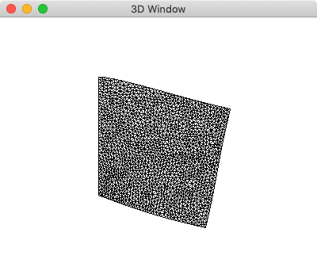

# Examples (Python)

## Build Python Module

    cd module_py
    mkdir buildMake
    cd buildMake
    cmake ..
    make

You can also use ``pip`` to install the module_py using the ``setup.py``

    pip install . -e


## Poisson's Equation


```python
import dfm2

cad = dfm2.Cad2D()
cad.add_polygon([-1,-1, +1,-1, +1,+1, -1,+1.0])
mesh = dfm2.mesh_cad(cad,0.05)
fem = dfm2.FEM_Poisson(mesh,source=1.0)
npIdP = dfm2.cad_getPointsEdge(cad,[0,1,2,3], mesh.np_pos, 1.0e-10)
fem.ls.vec_bc[npIdP] = 1
fem.solve()
field = dfm2.Field(mesh,val_color=fem.vec_val[:,0])
dfm2.winDraw3d([field])
```

* * *

## Linear Solid Static 2D

```python
import dfm2

cad = dfm2.Cad2D()
cad.add_polygon([-1,-1, +1,-1, +1,+1, -1,+1.0])
mesh = dfm2.mesh_cad(cad,0.05)
fem = dfm2.FEM_LinearSolidStatic(mesh,gravity=[0,-0.1])
npIdP = dfm2.cad_getPointsEdge(cad,[3], mesh.np_pos, 1.0e-10)
fem.ls.vec_bc[npIdP,:] = 1
fem.solve()
field = dfm2.Field(mesh,val_disp=fem.vec_val)
dfm2.winDraw3d([field])
```
