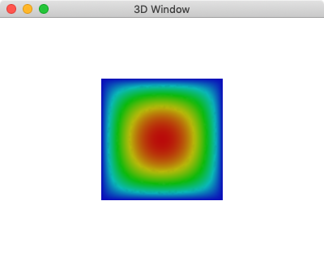

# Examples (Python)

## Build Python Module

    cd module_py
    mkdir buildMake
    cd buildMake
    cmake ..
    make

You can also use ``pip`` to install the module_py using the ``setup.py``

    pip install . -e


## Solving Poisson's Equation

Here is the example solving the Poisson's equation on a 2D square domain. The value on the boundary is fixed and there is a source term.

```python
import dfm2

cad = dfm2.Cad2D(list_xy=[-1,-1, +1,-1, +1,+1, -1,+1.0])
mesh = cad.mesh(0.05)
fem = dfm2.FEM_Poisson(mesh,source=1.0)
npIdP = cad.points_edge([0,1,2,3], mesh.np_pos)
fem.ls.vec_bc[npIdP] = 1
fem.solve()
field = dfm2.Field(mesh,val_color=fem.vec_val[:,0])
dfm2.winDraw3d([field])
```


The code is implemented based o the note I wrote: [Finite Element Method: Solving Poission's Equation](https://www.overleaf.com/read/qbyxxkyvzrgs).


* * *

## Solving Linear Solid Static 2D

In this example the static linear solid equation is solved in the 2D square domain. The XY displacement on the left edge is fixed and the gravity is pulling the material in the direction of -Y axis. 

```python
import dfm2

cad = dfm2.Cad2D(list_xy=[-1,-1, +1,-1, +1,+1, -1,+1.0])
mesh = cad.mesh(0.05)
fem = dfm2.FEM_LinearSolidStatic(mesh,gravity=[0,-0.1])
npIdP = cad.points_edge([3], mesh.np_pos)
fem.ls.vec_bc[npIdP,:] = 1
fem.solve()
field = dfm2.Field(mesh,val_disp=fem.vec_val)
dfm2.winDraw3d([field])
```


The code is implementaed based on the note I wrote [Finite Element Method: Solving Linear Solid Euqation](https://www.overleaf.com/read/vftvqkbgrfys). 
