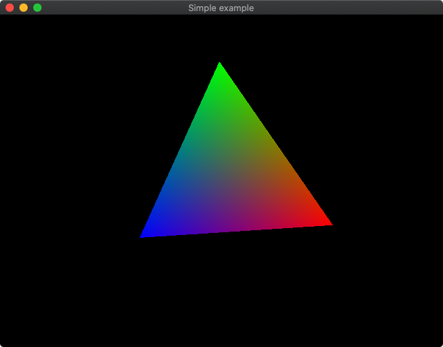
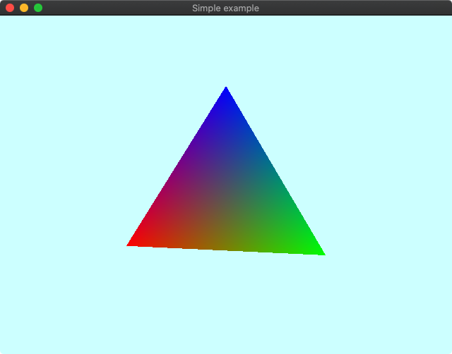
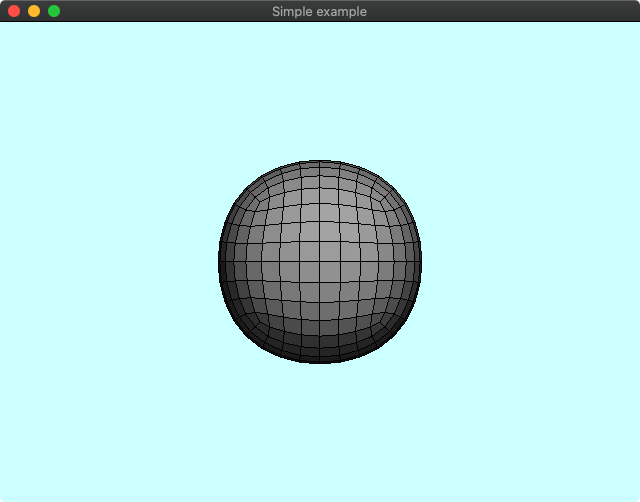
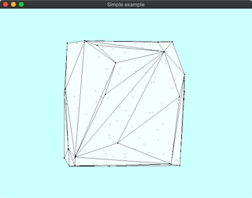
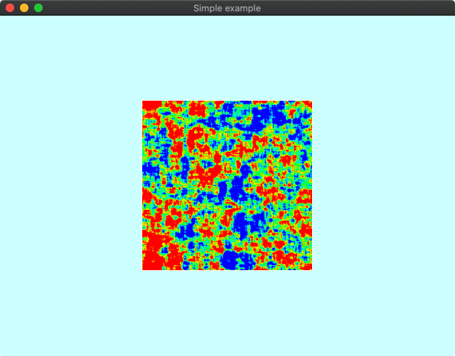
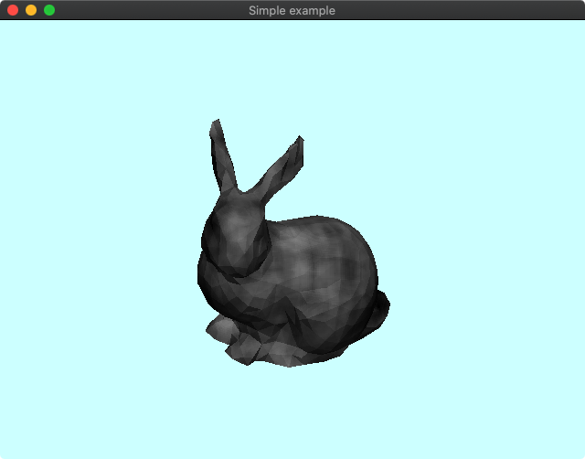
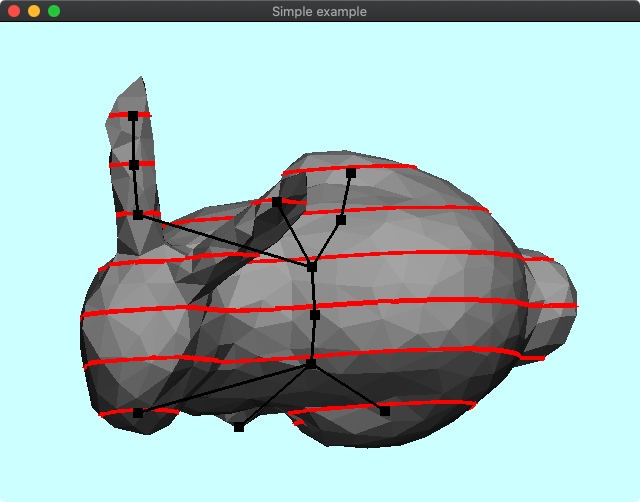
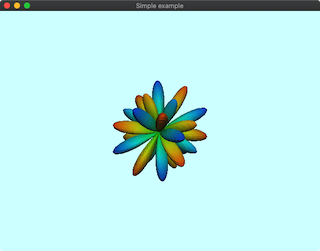

# DelFEM2 C++ Examples using Legacy OpenGL 

## Simple Example without DelFEM2

### 000 Nav3D

## Basic Geometry Operations

### 100 3D View Navigation

### 101 Subdivision Surface for Quad Mesh

### 102 Convexhull of 3D Points

### 103 noise2d

### 104 noise3d

### 105 meshslice

### 106 sphericalharmonics

