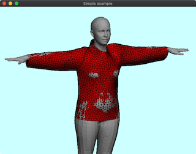

# 309_PbdClothCadSmpl



## How to run the demo:

download source code from GitHub and initialize
```
git clone https://github.com/nobuyuki83/delfem2.git
cd delfem2
git submodule update --init --recursive
cd 3rd_party/glfw
cmake .
make
cd ../../
```

compile the demo
```
mkdir build && cd build
cmake ..
make
```

get SMPL model
- Downlaod zip model file```SMPL_python_v.1.0.0.zip``` from https://smpl.is.tue.mpg.de/downloads
- Put ```basicModel_f_lbs_10_207_0_v1.0.0.pkl``` and ```basicmodel_m_lbs_10_207_0_v1.0.0.pkl``` to ```delfem2/test_inputs```.
- Install ```chumpy``` with the command ```pip3 install chmpy```
- Run ```delfem2/test_inputs/smpl_preprocess.py```
- Then ```smpl_model_f.npz```and ```smpl_model_m.npz``` will apper under ```delfem2/test_inputs/```


