# DelFEM2 C++ Examples using Legacy OpenGL 

## Simple Example without DelFEM2

### [000_OpenWin](000_OpenWindowWithGLFW)
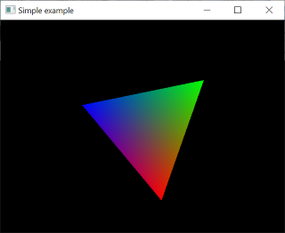

## Basic Demo

### [100_Nav3D](100_ViewNavigationIn3D)

### [101_SubdivCatmull](101_SubdivCatmull)
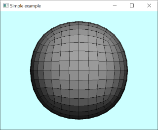

### [102_ConvexHull](102_ConvexHull)

### [103_Noise2d](103_Noise2)

### [104_Noise3](104_Noise3)
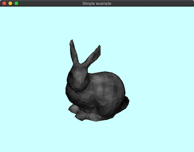

### [105_MeshSlice](105_MeshSlices)

### [106_SphericalHarmonics](106_SphericalHarmonics)

### [107_ParamGeo2d](107_ParamGeo2)

### [108_ParamGeo3d](108_ParamGeo3)

### [109_ContourLine2D](109_ContourLine2D)

### [112_OffscreenRendering](112_OffscreenRendering)

### [113_ProjectionBox](113_ProjectionBox)

### [114_CollisionLineHightfield](114_CollisionLineHightfield)
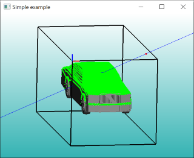

### [115_ExponentialMap](115_ExponentialMap)

### [116_GridOnMesh](116_GridOnMesh)
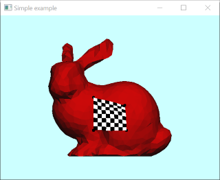

### [117_QuadSubdivOnMesh](117_QuadSubdivOnMesh)

### [120_Adf3](120_AdaptiveDistanceField)
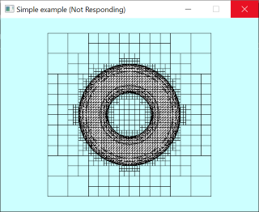

### [121_IsoSurfaceStuffing](121_IsoSurfaceStuffing)

### [122_HashBvhSelfCollision](122_HashBvhSelfCollision)

### [123_HashLbvh3D](123_HashLbvh3D)

### [124_4RotSymField](124_4RotSymField)

### [201_DynTri2Triangulation](201_DynTri2dTriangulation)

### [202_DynTri2Remesh](202_DynTri2dRemesh)
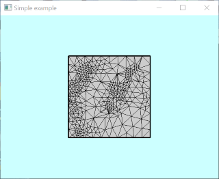

### [203_DynTri3_EdgeCollapse](203_DynTri3dEdgeCollapses)
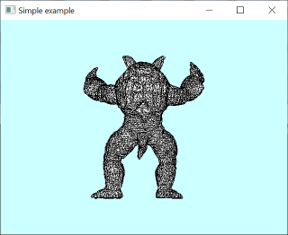

### [204_DynTet_Tetrahedralization](204_DynTetTetrahedralization)
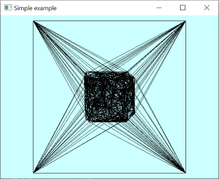

### [300_RigSmplArticulated](300_RigSmplArticulated)

### [301_RigSmplTransfer](301_RigSmplTransfer)

### [302_RigReadFileBiovision](302_RigReadFileBiovision)

### [304_RigSmplIk](304_RigSmplIk)

### [305_RigSmplIkArap](305_RigSmplIkArap)

### [306_RigSmplIklmage](306_RigSmplIklmage)

### [307_RigSmplIklmageCloth](307_RigSmplIklmageCloth)

## User Interface

### [400_UiGizmoRot](400_UiGizmoRot)

### [401_UiGizmoTransl](401_UiGizmoTransl)

### [402_UiGizmoAffine](402_UiGizmoAffine)

### [403_UiArap](403_UiArap)

### [500_Cad2d](500_Cad2d)

### [501_Cad2dEdit](501_Cad2dEdit)

### [502_Cad2dMeshEdit](502_Cad2dMeshEdit)

### [503_Cad3d](503_Cad3d)
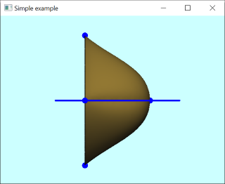

### [504_Cad2dSvg](504_Cad2dSvg)

### [505_Cad3ReadStep](505_Cad3ReadStep)

### [600_Fem2Helmholtz](600_Fem2DHelmholtz)

### [601_FemPlateBendingMitc3](601_FemPlateBendingMitc3)
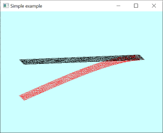

### [602_Fem3Eigen](602_Fem3DEigen)

### [603_Fem3StiffWarp](603_Fem3DStiffwarp)
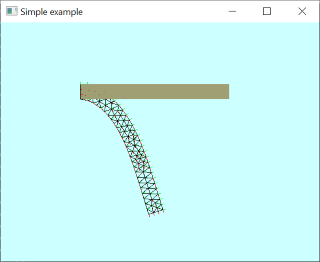

### [604_FemClothDTri](604_FemCloth_DynamicTriangle)

### [605_FemClothInternal](605_FemClothInternal)

### [606_PbdDeform2D](606_PbdGrid2D)

### [607_PbdCloth](607_PbdCloth)
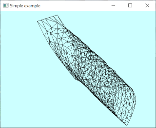

### [608_FdmFluid2D](608_FdmFluid2D)

### [609_DefLaplacianMesh](609_DefLaplacian)

### [610_DefArapEdge](610_DefArapEdge)

### [611_DefArap](611_DefArap)

### [612_BemPotentialFlow3D](612_BemPotentialFlow3D)
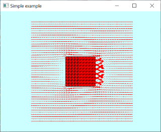

### [613_FemRod](613_FemRod)
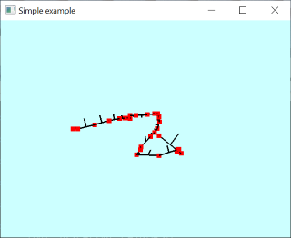

### [614_FemMitc3Eigen](614_FemMitc3Eigen)

### [615_PbdClothCad](615_PbdClothCad)

### [616_PbdClothCadGltf](616_PbdClothCadGltf)
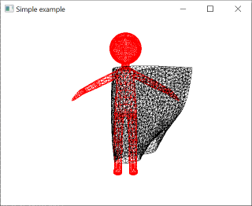

### [618_Fem3d](618_Fem3d)
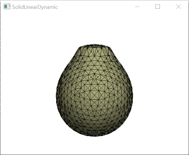

### [619_Sph2d](619_Sph2d)

### [620_FemClothSelfCollision](620_FemClothSelfCollision)
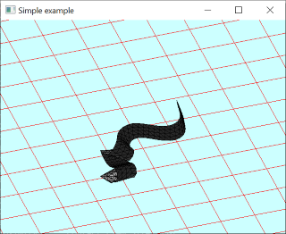

### [621_Fem2d](621_Fem2D)
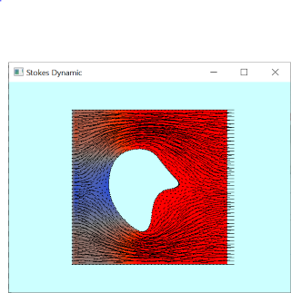

