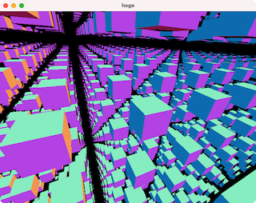

## 08_SphereTracing

### Reference 

- Hart, J. Sphere tracing: a geometric method for the antialiased ray tracing of implicit surfaces. *The Visual Computer* **12,** 527–545 (1996). https://doi.org/10.1007/s003710050084
- [Rendering Implicit Surfaces and Distance Fields: Sphere Tracing](https://www.scratchapixel.com/lessons/advanced-rendering/rendering-distance-fields)

