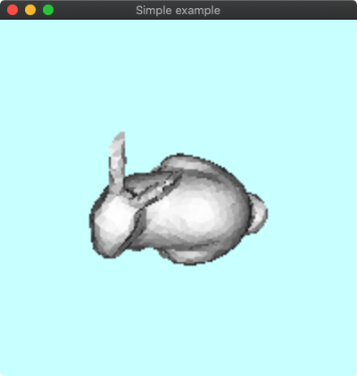
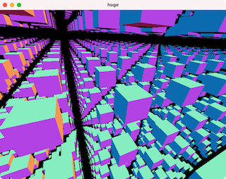

### [00_openwin](00_openwin)

### [01_drawrect](01_drawrect)

### [02_nav3d](02_nav3d)

### [03_texture](03_texture)

### [04_render2texture](04_render2texture)

### [05_OffScreenProjection](05_OffScreenProjection)

### [06_VolumeRenderingSlice](06_VolumeRenderingSlice)

### [07_RayCasting](07_RayCasting)

### [08_SphereTracing](08_SphereTracing)

### [09_VolumeRenderingRayCasting](09_VolumeRenderingRayCasting)

### [10_FlatColorTriangles](10_FlatColorTriangles)

### [11_TriangleSelect](11_TriangleSelect)

### [12_PathTracingSimple](12_PathTracingSmallpt)

### [13_PathTracingTriMesh](13_PathTracingTriMesh)

### [20_cad2d](20_cad2d)

### [30_cadmsh2d](30_cadmsh2d)

### [40_femcloth](40_femcloth)

### [41_fem2d_poisson](41_fem2d_poisson)

### [42_fem2d_linearsolid](42_fem2d_linearsolid)

