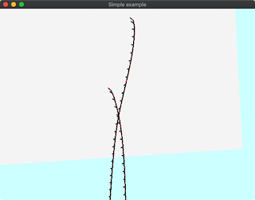

# 617_FemRodHairSelfcollision


## About

This program demonstrates the dynamic deformation of hairs include contacts.

The elastic energy is given by the frames defined on the polyline segment.
See the demo [622_FemRodHairStatic](../622_FemRodHairStatic/readme.md) for the demonstration of this elastic energy, [623_FemRodHairDynamic](../623_FemRodHairDynamic/readme.md) for the dynamic deformation without contact.


Time integration is solved using the variational implicit Euler integration.


## Technical detail
The implementation of the discrete elastic rod is based on following two papers:

```
"Discrete Viscous Threads"
Miklós Bergou, Basile Audoly, Etienne Vouga, Max Wardetzky, Eitan Grinspun
ACM Transactions on Graphics (SIGGRAPH) 2010
http://www.cs.columbia.edu/cg/threads/
```

```
"Efficient Yarn-based Cloth with Adaptive Contact Linearization"
Jonathan M. Kaldor, Doug L. James, Steve Marschner
ACM SIGGRAPH 2010
https://research.cs.cornell.edu/YarnCloth/
```

This formulation changes the frame of a rod's segment using the parallel transport in the time-domain.

