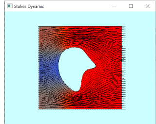

# 621_Fem2

Finite Element Method (FEM) simulation.

- poisson equation
- diffusion equation
- static linear elastic
- dynamic linear elastic 
- static stokes equation
- dynamic stokes equation
- navier-stokes equation