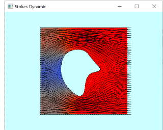

# 625_Fem2MasterSlave

Finite Element Method (FEM) simulation with master/slave constraint.

- static linear elastic
- dynamic linear elastic 
- static stokes equation
- dynamic stokes equation
- navier-stokes equation  