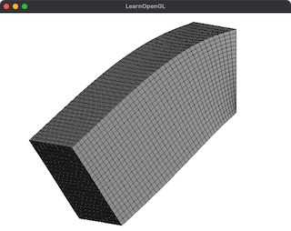

# 628_FemHyper3

FEM simulation of 2nd order Mooney-Rivlin solid with reduced invairants in a hex mesh.
The incompressive condition is implemented with a penalty method with selective reduced integral.