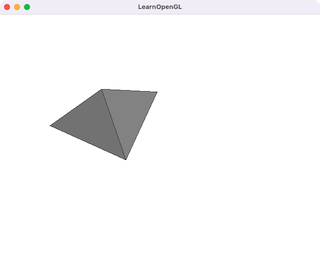

# 636_InvertibleFem

- G. Irving, J. Teran, and R. Fedkiw. 2004. Invertible finite elements for robust simulation of large deformation. In Proceedings of the 2004 ACM SIGGRAPH/Eurographics symposium on Computer animation (SCA '04). Eurographics Association, Goslar, DEU, 131–140. DOI:https://doi.org/10.1145/1028523.1028541

- Joseph Teran, Eftychios Sifakis, Geoffrey Irving, and Ronald Fedkiw. 2005. Robust quasistatic finite elements and flesh simulation. In Proceedings of the 2005 ACM SIGGRAPH/Eurographics symposium on Computer animation (SCA '05). Association for Computing Machinery, New York, NY, USA, 181–190. DOI:https://doi.org/10.1145/1073368.1073394
