# DelFEM2 C++ Examples using Legacy OpenGL

These demos use OpenGL version 2.1 and GLSL shaer version 1.2 which are depricated in many environment. But still it is convenient to use legacy functions such as glBegin(), glEnd(). We will eventually consider porting these demo into newer OpenGL >= 3.3 in the [examples_newgl_glfw](../examples_newgl_glfw) folder.


## How To Build

These demos depend on the GLFW library to open an OpenGL window. If you haven't install `glfw` in your computer, please read following Document to set up GLFW.

- [How to Set Up GLFW Library](../docs/setup_glfw.md)
- [GLFWライブラリの設定方法](../docs/setup_glfw_jp.md)

With `glfw` installed, you can build the demos simply by 

```bash
mkdir build && cd build
cmake ..
cmake --build .
```


## Simple Example without DelFEM2

### [000_OpenWin](000_OpenWindowWithGLFW)


## Basic Demo

### [100_Nav3D](100_ViewNavigationIn3D)


### [101_SubdivCatmull](101_SubdivCatmull)


### [102_ConvexHull](102_ConvexHull)


### [103_Noise2d](103_Noise2)


### [104_Noise3](104_Noise3)


### [105_MeshSlice](105_MeshSlices)
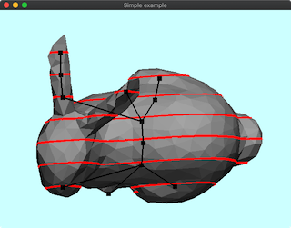

### [106_SphericalHarmonics](106_SphericalHarmonics)


### [107_ParamGeo2d](107_ParamGeo2)
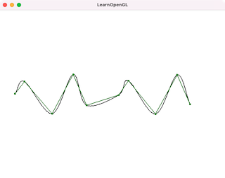

### [108_ParamGeo3d](108_ParamGeo3)


### [109_ContourLine2D](109_ContourLine2D)


### [110_ClusteringMesh](110_ClusteringMesh)
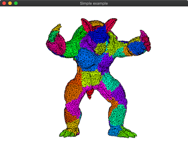

### [111_ExponentialMapElem](111_ExponentialMapElem)

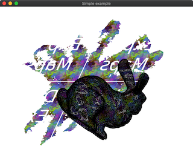

### [112_OffscreenRendering](112_OffscreenRendering)


### [113_ProjectionBox](113_ProjectionBox)


### [114_CollisionLineHightfield](114_CollisionLineHightfield)


### [115_ExponentialMapPoint](115_ExponentialMapPoint)
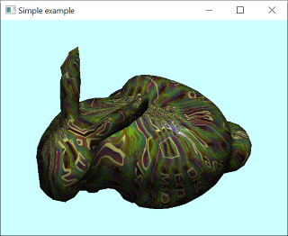

### [116_GridOnMesh](116_GridOnMesh)


### [117_QuadSubdivOnMesh](117_QuadSubdivOnMesh)
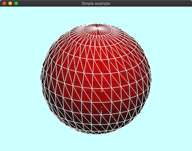

### [118_FastMarchingMethod](118_FastMarchingMethod)
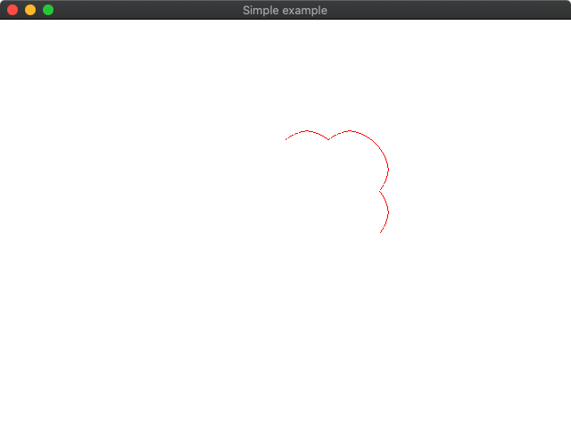

### [119_Glyph](119_Glyph)
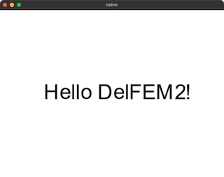

### [120_Adf3](120_AdaptiveDistanceField)


### [121_IsoSurfaceStuffing](121_IsoSurfaceStuffing)


### [122_HashBvhSelfCollision](122_HashBvhSelfCollision)


### [123_HashLbvh3D](123_HashLbvh3D)
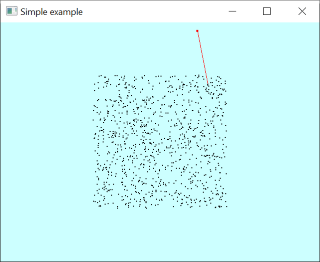

### [124_4RotSymField](124_4RotSymField)


### [125_GizmoRot](125_GizmoRot)


### [126_GizmoTransl](126_GizmoTransl)


### [127_GizmoAffine](127_GizmoAffine)


### [128_Voxelize](128_Voxelize)


### [129_CubeGridEdit](129_CubeGridEdit)


### [130_VoxelMorph](130_VoxelMorph)
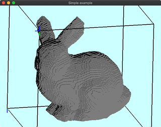

### [131_Shader](131_Shader)


### [132_ShaderTexLaplace](132_ShaderTexLaplace)


### [133_ShaderContour](133_ShaderContour)
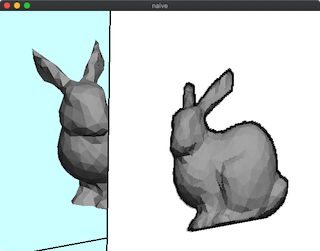

### [134_Primitives](134_Primitives)
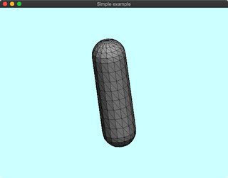

### [135_GlBuffer](135_GlBuffer)
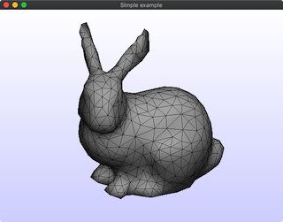

### [136_VoxelGeodesic](136_VoxelGeodesic)


### [137_VoxelLineIntersection](137_VoxelLineIntersection)


### [138_RigReadFileBiovision](138_RigReadFileBiovision)
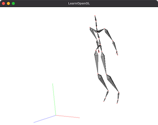

### [140_RigVoxelGeodesic](140_RigVoxelGeodesic)


### [141_RigBendCapsule](141_RigBendCapsule)


### [142_BinaryClusteringPoints3D](142_BinaryClusteringPoints3D)
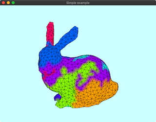

### [143_Image2MeshInterpolation](143_Image2MeshInterpolation)


### [144_BinaryClusteringPoints2D](144_BinaryClusteringPoints2D)


### [145_Lloyd](145_Lloyd)
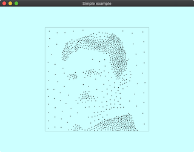

### [146_4RotSymFieldMultilevel](146_4RotSymFieldMultilevel)


### [147_HashLbvh3RayTri](147_HashLbvh3RayTri)
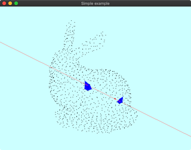

### [148_RayTracingSimple](148_RayTracingSimple)

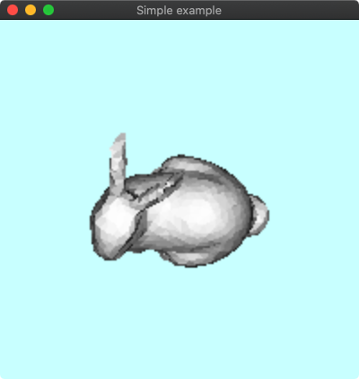


## Dynamic Triangle

### [201_DynTri2Triangulation](201_DynTri2dTriangulation)


### [202_DynTri2Remesh](202_DynTri2dRemesh)


### [203_DynTri3_EdgeCollapse](203_DynTri3dEdgeCollapses)


### [204_DynTet_Tetrahedralization](204_DynTetTetrahedralization)


### [205_DynTri3SimpilfyQuadratic](205_DynTri3SimpilfyQuadratic)


## CAD

### [500_Cad2d](500_Cad2d)


### [501_Cad2dEdit](501_Cad2dEdit)


### [502_Cad2dMeshEdit](502_Cad2dMeshEdit)
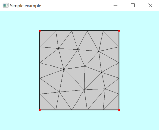

### [503_Cad3d](503_Cad3d)


### [504_Cad2dSvg](504_Cad2dSvg)
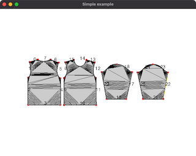

### [505_Cad3ReadStep](505_Cad3ReadStep)


## Simulation (FEM,FDM,PBD,BEM,SPH,Arap)

### [600_Fem2Helmholtz](600_Fem2DHelmholtz)
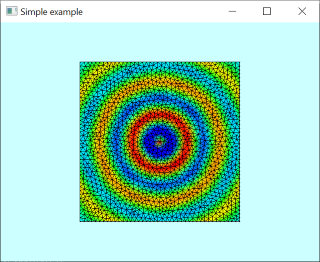

### [601_FemPlateBendingMitc3](601_FemPlateBendingMitc3)


### [602_Fem3Eigen](602_Fem3DEigen)


### [603_Fem3StiffWarp](603_Fem3DStiffwarp)


### [604_FemClothDTri](604_FemCloth_DynamicTriangle)


### [605_FemClothInternal](605_FemClothInternal)


### [606_PbdDeform2D](606_PbdGrid2D)
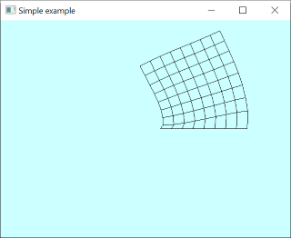

### [607_PbdCloth](607_PbdCloth)


### [608_FdmFluid2D](608_FdmFluid2D)


### [609_DefLaplacianMesh](609_DefLaplacian)
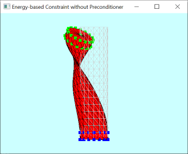

### [610_DefArapEdge](610_DefArapEdge)


### [611_DefArap](611_DefArap)


### [612_BemPotentialFlow3D](612_BemPotentialFlow3D)


### [613_FemRod](613_FemRod)


### [614_FemMitc3Eigen](614_FemMitc3Eigen)


### [615_PbdClothCad](615_PbdClothCad)
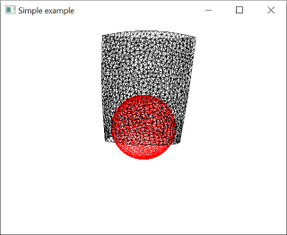

### [617_FemRodHairSelfcollision](617_FemRodHairSelfcollision)
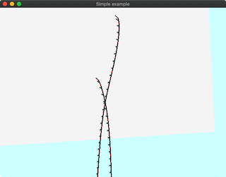

### [618_Fem3d](618_Fem3d)


### [619_Sph3](619_Sph3)
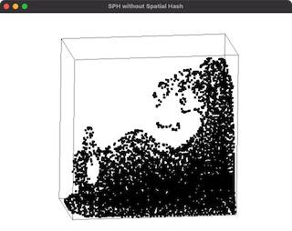

### [620_FemClothSelfCollision](620_FemClothSelfCollision)


### [621_Fem2d](621_Fem2D)


### [622_FemRodHairStatic](622_FemRodHairStatic)


### [623_FemRodHairDynamic](623_FemRodHairDynamic)


### [624_DefArapUi](624_DefArapUi)


### [625_DefLaplacianFitProj](625_DefLaplacianFitProj)


### [626_RgdRotation](626_RgdRotation)
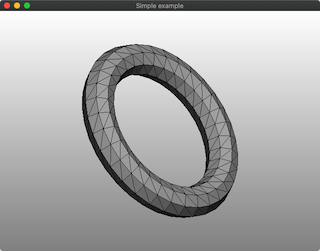

### [627_Rgd2dCollision](627_Rgd2dCollision)
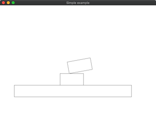

### [628_FemHyper3](628_FemHyper3)
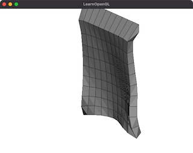


### [629_Rgd2Mode](629_Rgd2Mode)

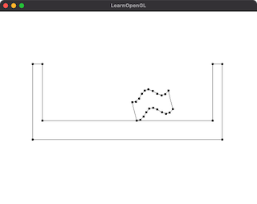