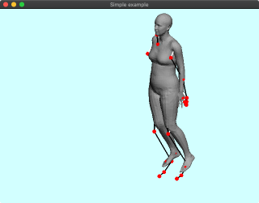
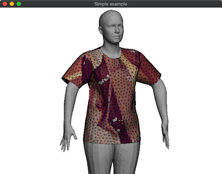

# DelFEM2 C++ Examples using SMPL data


## SMPL Model Preparation

1. Downlaod zip model file```SMPL_python_v.1.0.0.zip``` from https://smpl.is.tue.mpg.de/downloads
2. Put ```basicModel_f_lbs_10_207_0_v1.0.0.pkl``` and ```basicmodel_m_lbs_10_207_0_v1.0.0.pkl``` to ```delfem2/test_inputs```.
3. Install ```chumpy``` with the command ```pip3 install chmpy```
4. Run ```delfem2/test_inputs/smpl_preprocess.py```
5. Then ```smpl_model_f.npz```and ```smpl_model_m.npz``` will apper under ```delfem2/test_inputs/```


## Note 

These demos use OpenGL version 2.1 and GLSL shaer version 1.2 which are depricated in many environment. But still it is convenient to use legacy functions such as glBegin(), glEnd(). We will eventually consider porting these demo into newer OpenGL >= 3.3 in the examples_glfwnew folder.


## Demos

### [00_PoseBone](00_PoseBone)


### [01_RigTransfer](01_RigTransfer)


### [02_Ik](02_Ik)


### [03_IkArap](03_IkArap)


### [04_IkImage](04_IkImage)


### [05_Ui](05_Ui)


### [10_Cloth](10_Cloth)


### [11_ClothPose](11_ClothPose)


### [12_IkImageCloth](12_IkImageCloth)


### [13_ClothPoseRig](13_ClothPoseRig)


### [14_ClothPoseTexture](14_ClothPoseTexture)




### [20_PoseBoneBlendshape](20_PoseBoneBlendshape)


