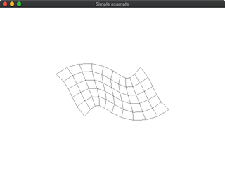
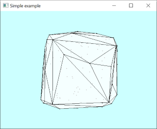
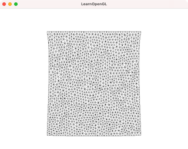
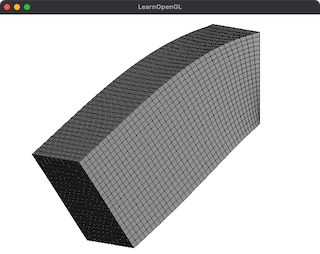

# DelFEM2 Examples using Legacy OpenGL

These demos depend on glfw library and [Eigen](https://eigen.tuxfamily.org/index.php?title=Main_Page) library for matrix operation. 

Please take a look at the following document to set up these library. 

- [How to set up Eigen](../docs/setup_eigen.md)  

- [How to set up glfw](../docs/setup_glfw.md)  

These demos use legacy OpenGL (version 2.1 and GLSL shaer version 1.2) which are depricated in many environment. 
But still it is convenient to use legacy functions such as glBegin(), glEnd(). 

## EigenModes

### [00_EigenModes](00_EigenModes)

### [01_ConvexHull](01_ConvexHull)

### [02_FemSolidLinear2](02_FemSolidLinear2)

### [03_FemSolidLinear3](03_FemSolidLinear3)

