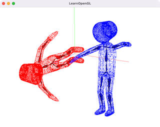

# DelFEM2 C++ Examples using TinyGLTF & Legacy OpenGL

These demos use OpenGL version 2.1 and GLSL shaer version 1.2 which are depricated in many environment. But still it is convenient to use legacy functions such as glBegin(), glEnd(). We will eventually consider porting these demo into newer OpenGL >= 3.3 in the [examples_glfwnew folder](../examples_glfwnew).


## Download dependencies

```bash
# move to the top directory
cd delfem2

# download tinygltf 
git submodule update --init -- 3rd_party/tinygltf

# download glfw and compile it
git submodule update --init -- 3rd_party/glfw
cd 3rd_party/glfw
cmake .
make
cd ../..
```


### [00_RigReadFileGLTF](00_RigReadFileGLTF)


### [10_PbdClothCadGltf](10_PbdClothCadGltf)


[../examples_glfwnew]: 