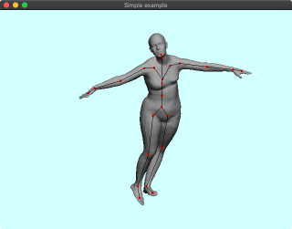

# DelFEM2 C++ Examples using SMPL data

These demos use OpenGL version 2.1 and GLSL shaer version 1.2 which are depricated in many environment. But still it is convenient to use legacy functions such as glBegin(), glEnd(). We will eventually consider porting these demo into newer OpenGL >= 3.3 in the examples_glfwnew folder.

### [000_RigSmplArticulated](000_RigSmplArticulated)

### [001_RigSmplTransfer](001_RigSmplTransfer)

### [002_RigSmplIk](002_RigSmplIk)

### [003_RigSmplIkArap](003_RigSmplIkArap)

### [004_RigSmplIkImage](004_RigSmplIkImage)

### [005_RigSmplIkImageCloth](005_RigSmplIkImageCloth)

### [006_RigSmplUi](006_RigSmplUi)

### [007_RigSmplCloth](007_RigSmplCloth)

### [008_RigSmplClothPose](008_RigSmplClothPose)

