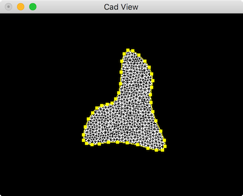

# DelFEM2

A handy toolset for coding geometry processing and fem simulation

The implementation is based on the [DelFEM](https://github.com/nobuyuki83/DelFEM) library

## Examples

- working directory is in the folder `examples/`
- binary files are put in the folder `examples/bin/`
- input files are put in the folder `test_inputs/`
- The scripts to run the executable is put in `examples/script/`

| Name | Screen Shot |
| ------------- | ------------- |
| triangulation |  |
| transform_handler  |  |
| cloth_internal |  |
| subdiv |  |

## Coding

### Philosophy
- remove dependency between the codes as much as possible
- low level code must compile C++98

### Rule
- use double space for a tab

### Element Index Rule

Based on the elemnt index rule in VTK( https://www.vtk.org/wp-content/uploads/2015/04/file-formats.pdf )

### Naming Convention
* use the extension ".h" instead of ".hpp"
* filename should be in lower case. The underscore represent depndency. For example "aa_bb.cpp" means this is a implementation of class "aaa" and it depends on a class "bbb"
* The function name should be written in camel case notation that sarts with upper case letter (e.g., Verb_Object_Adverb)
* Geometric Operator
  * Nearest
  * Intersection
  * IsInside
  * Volume
  * Area
* Read Write
  * Read <-> Write
  * Load <-> Save
* Naming Point
  * CAD Vertex -> Vertex
  * Mesh Point -> Point
  * point index inside element (may be on edge or on face) -> Node
* How to call a mesh?
  * MeshTri3D
  * MeshQuad2D
  * MeshHex3D
  * MeshMix3D
  * MeshElem3D
  * Point3D
  * MeshHex3DSurface